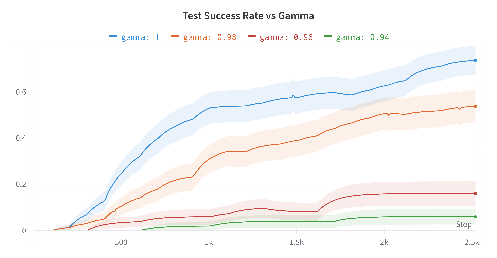
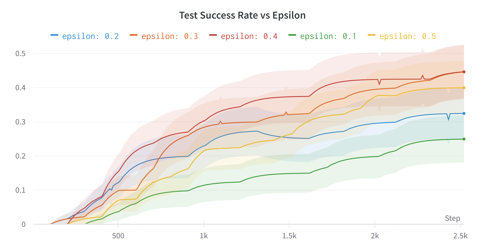
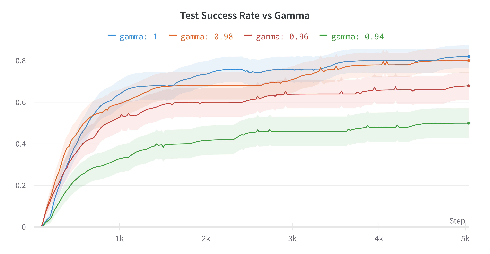
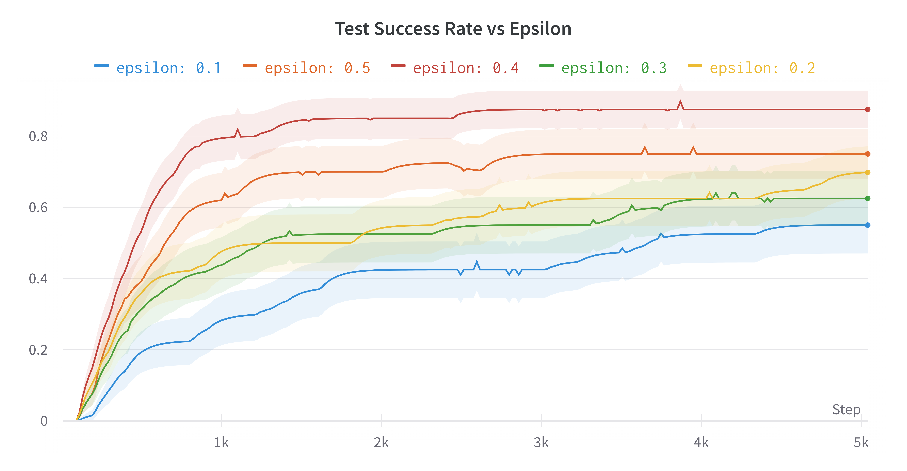
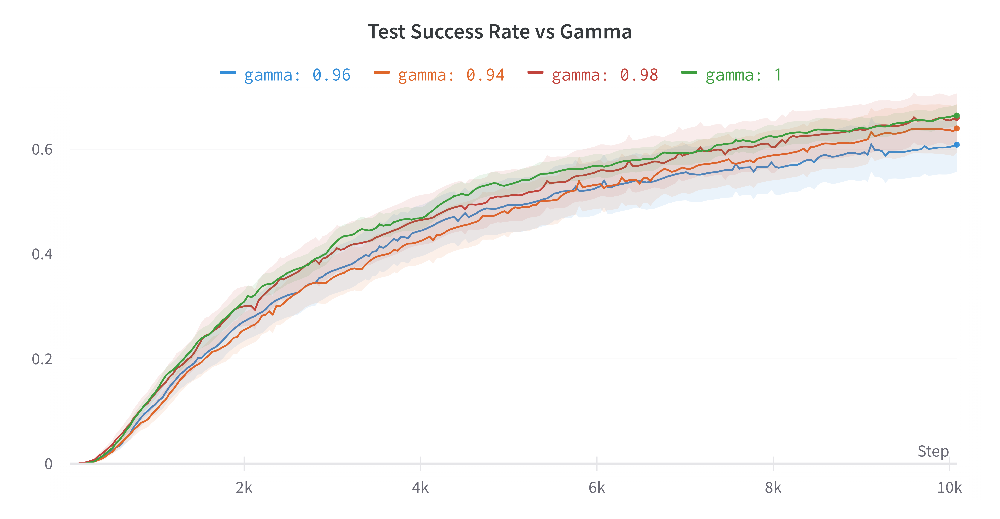
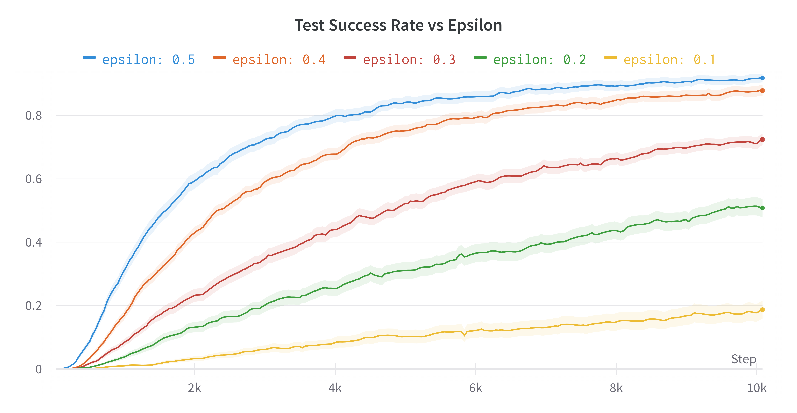

# CS581 Final Project - Dynamic Programming & Monte-Carlo RL Methods

Authors: Andrei Cozma and Landon Harris

Evolution of Reinforcement Learning methods from pure Dynamic Programming-based methods to Monte Carlo methods + Bellman Optimization Comparison  

[Google Slides](https://docs.google.com/presentation/d/1v4WwBQKoPnGiyCMXgUs-pCCJ8IwZqM3thUf-Ky00eTQ/edit?usp=sharing)

# 1. Requirements

Python 3.6+ with the following major dependencies:

- Gymnasium: <https://pypi.org/project/gymnasium/>
- WandB: <https://pypi.org/project/wandb/> (for logging)
- Gradio: <https://pypi.org/project/gradio/> (for demo web app)

Install all the dependencies using `pip`:

```bash
❯ pip3 install -r requirements.txt
```

# 2. Interactive Demo

HuggingFace Space: [acozma/CS581-Algos-Demo](https://huggingface.co/spaces/acozma/CS581-Algos-Demo)

Launch the Gradio demo web app locally:

```bash
❯ python3 demo.py
Running on local URL:  http://127.0.0.1:7860
```


# 2. Agents

## 2.1. Dynamic-Programming Agent

TODO

## 2.2. Monte-Carlo Agent

This is the implementation of an On-Policy Monte-Carlo agent to solve several toy problems from the OpenAI Gymnasium.  

The agent starts with a randomly initialized epsilon-greedy policy and uses either the first-visit or every-visit Monte-Carlo update method to learn the optimal policy. Training is performed using a soft (epsilon-greedy) policy and testing uses the resulting greedy policy.

### Parameter testing results

**CliffWalking-v0**  

<table>
  <tr>
    <td></td>
    <td></td>
  </tr>
</table>

**FrozenLake-v1**  
<table>
  <tr>
    <td></td>
    <td></td>
  </tr>
</table>

**Taxi-v3**  
<table>
  <tr>
    <td></td>
    <td></td>
  </tr>
</table>

# 3. Run Script Usage

```bash
# Training: Policy will be saved as a `.npy` file.
❯ python3 run.py --agent "MCAgent" --train

# Testing: Use the `--test` flag with the path to the policy file.
❯ python3 run.py --agent "MCAgent" --test "./policies/[saved_policy_file].npy" --render_mode human

❯ python3 run.py --help
usage: run.py [-h] [--train] [--test TEST] [--n_train_episodes N_TRAIN_EPISODES] [--n_test_episodes N_TEST_EPISODES] [--test_every TEST_EVERY] [--max_steps MAX_STEPS] --agent {MCAgent,DPAgent} [--gamma GAMMA] [--epsilon EPSILON] [--update_type {first_visit,every_visit}]
              [--env {CliffWalking-v0,FrozenLake-v1,Taxi-v3}] [--seed SEED] [--size SIZE] [--render_mode RENDER_MODE] [--save_dir SAVE_DIR] [--no_save] [--run_name_suffix RUN_NAME_SUFFIX] [--wandb_project WANDB_PROJECT] [--wandb_job_type WANDB_JOB_TYPE]

options:
  -h, --help            show this help message and exit
  --train               Use this flag to train the agent.
  --test TEST           Use this flag to test the agent. Provide the path to the policy file.
  --n_train_episodes N_TRAIN_EPISODES
                        The number of episodes to train for. (default: 2500)
  --n_test_episodes N_TEST_EPISODES
                        The number of episodes to test for. (default: 100)
  --test_every TEST_EVERY
                        During training, test the agent every n episodes. (default: 100)
  --max_steps MAX_STEPS
                        The maximum number of steps per episode before the episode is forced to end. (default: 200)
  --agent {MCAgent,DPAgent}
                        The agent to use. Currently supports one of: ['MCAgent', 'DPAgent']
  --gamma GAMMA         The value for the discount factor to use. (default: 0.99)
  --epsilon EPSILON     The value for the epsilon-greedy policy to use. (default: 0.4)
  --update_type {first_visit,every_visit}
                        The type of update to use. Only supported by Monte-Carlo agent. (default: first_visit)
  --env {CliffWalking-v0,FrozenLake-v1,Taxi-v3}
                        The Gymnasium environment to use. (default: CliffWalking-v0)
  --seed SEED           The seed to use when generating the FrozenLake environment. If not provided, a random seed is used. (default: None)
  --size SIZE           The size to use when generating the FrozenLake environment. (default: 8)
  --render_mode RENDER_MODE
                        Render mode passed to the gym.make() function. Use 'human' to render the environment. (default: None)
  --save_dir SAVE_DIR   The directory to save the policy to. (default: policies)
  --no_save             Use this flag to disable saving the policy.
  --run_name_suffix RUN_NAME_SUFFIX
                        Run name suffix for logging and policy checkpointing. (default: None)
  --wandb_project WANDB_PROJECT
                        WandB project name for logging. If not provided, no logging is done. (default: None)
  --wandb_job_type WANDB_JOB_TYPE
                        WandB job type for logging. (default: train)
```
