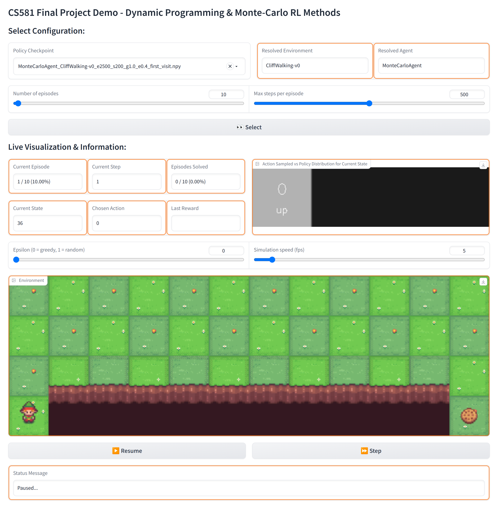

# CS581 Project - Reinforcement Learning: From Dynamic Programming to Monte-Carlo

[Google Slides](https://docs.google.com/presentation/d/1v4WwBQKoPnGiyCMXgUs-pCCJ8IwZqM3thUf-Ky00eTQ/edit?usp=sharing)

Evolution of Reinforcement Learning methods from pure Dynamic Programming-based methods to Monte Carlo methods + Bellman Optimization Comparison  

# 1. Requirements

Python 3.6+ with the following major dependencies:

- Gymnasium: <https://pypi.org/project/gymnasium/>
- WandB: <https://pypi.org/project/wandb/> (for logging)
- Gradio: <https://pypi.org/project/gradio/> (for demo web app)

Install all the dependencies using `pip`:

```bash
❯ pip3 install -r requirements.txt
```

# 2. Interactive Demo

HuggingFace Space: [acozma/CS581-Algos-Demo](https://huggingface.co/spaces/acozma/CS581-Algos-Demo)

Launch the Gradio demo web app locally:

```bash
❯ python3 demo.py
Running on local URL:  http://127.0.0.1:7860
```



# 2. Agents

## 2.1. Dynamic-Programming Agent

TODO

**DP Usage:**

```bash
TODO
```

## 2.2. Monte-Carlo Agent

This is the implementation of an On-Policy Monte-Carlo agent to solve several toy problems from the OpenAI Gymnasium.  

The agent starts with a randomly initialized epsilon-greedy policy and uses either the first-visit or every-visit Monte-Carlo update method to learn the optimal policy. Training is performed using a soft (epsilon-greedy) policy and testing uses the resulting greedy policy.

Off-policy methods using importance sampling are not implemented for this project.

Parameter testing results:  

- `run_tests_MC_CliffWalking-v0.sh` (n_train_episodes=2500 and max_steps=200)
  - Best Update Type: first_visit
  - Best Gamma: 1.0
  - Best Epsilon: 0.4
- `run_tests_MC_FrozenLake-v1.sh` (n_train_episodes=10000 and max_steps=200)
  - Best Update Type: first_visit
  - Best Gamma: 1.0
  - Best Epsilon: 0.5 (testing) and 0.2 (training)

```bash
# Training: Policy will be saved as a `.npy` file.
python3 MonteCarloAgent.py --train

# Testing: Use the `--test` flag with the path to the policy file.
python3 MonteCarloAgent.py --test policy_mc_CliffWalking-v0_e2000_s500_g0.99_e0.1.npy --render_mode human
```

**MC Usage**

```bash
usage: MonteCarloAgent.py [-h] [--train] [--test TEST] [--n_train_episodes N_TRAIN_EPISODES] [--n_test_episodes N_TEST_EPISODES] [--test_every TEST_EVERY] [--max_steps MAX_STEPS] [--update_type {first_visit,every_visit}] [--save_dir SAVE_DIR] [--no_save]
                          [--gamma GAMMA] [--epsilon EPSILON] [--env {CliffWalking-v0,FrozenLake-v1,Taxi-v3}] [--render_mode RENDER_MODE] [--wandb_project WANDB_PROJECT] [--wandb_group WANDB_GROUP] [--wandb_job_type WANDB_JOB_TYPE]
                          [--wandb_run_name_suffix WANDB_RUN_NAME_SUFFIX]

options:
  -h, --help            show this help message and exit
  --train               Use this flag to train the agent.
  --test TEST           Use this flag to test the agent. Provide the path to the policy file.
  --n_train_episodes N_TRAIN_EPISODES
                        The number of episodes to train for. (default: 2500)
  --n_test_episodes N_TEST_EPISODES
                        The number of episodes to test for. (default: 100)
  --test_every TEST_EVERY
                        During training, test the agent every n episodes. (default: 100)
  --max_steps MAX_STEPS
                        The maximum number of steps per episode before the episode is forced to end. (default: 200)
  --update_type {first_visit,every_visit}
                        The type of update to use. (default: first_visit)
  --save_dir SAVE_DIR   The directory to save the policy to. (default: policies)
  --no_save             Use this flag to disable saving the policy.
  --gamma GAMMA         The value for the discount factor to use. (default: 1.0)
  --epsilon EPSILON     The value for the epsilon-greedy policy to use. (default: 0.4)
  --env {CliffWalking-v0,FrozenLake-v1,Taxi-v3}
                        The Gymnasium environment to use. (default: CliffWalking-v0)
  --render_mode RENDER_MODE
                        Render mode passed to the gym.make() function. Use 'human' to render the environment. (default: None)
  --wandb_project WANDB_PROJECT
                        WandB project name for logging. If not provided, no logging is done. (default: None)
  --wandb_group WANDB_GROUP
                        WandB group name for logging. (default: monte-carlo)
  --wandb_job_type WANDB_JOB_TYPE
                        WandB job type for logging. (default: train)
  --wandb_run_name_suffix WANDB_RUN_NAME_SUFFIX
                        WandB run name suffix for logging. (default: None)
```
